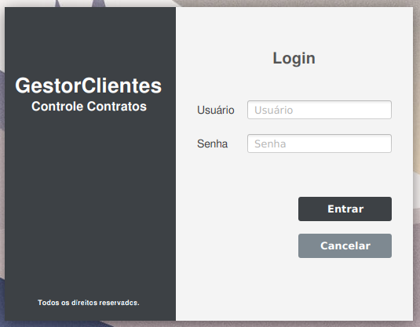

# LoginApp




> Aplicação desktop para autenticação de usuários, para futura implementação em aplicação de controle de clientes e contratos.


### Ajustes e melhorias

O projeto ainda está em desenvolvimento e as próximas atualizações serão voltadas nas seguintes tarefas:

- [ ] Tela de cadastro
- [ ] Tela esqueci minha senha
- [ ] Tela de clientes
- [ ] Tela de contratos

## 💻 Pré-requisitos

Antes de começar, verifique se você atendeu aos seguintes requisitos:

- Você deve instalar a versão mais recente de `<Java / JavaFX / SceneBuilder / MySQL>`
- Você tem uma máquina `<Windows / Linux / Mac>`.

## ☕ Usando <loginapp>

Para usar <loginapp>, siga estas etapas:


1. Instale o JDK de sua preferência (recomendo as versões mais atuais)
2. Neste projeto utilizei o Intellij Idea Community como [IDE](https://www.jetbrains.com/idea/).
3. Configure o JavaFX e o SceneBuilder. [link tutorial](https://youtu.be/IZCwawKILsk?si=sDL2kMTfOenXx2Yv)
4. Instale as depêndencias do Maven.
5. Configure seu banco de dados MySql dentro da classe ```DatabaseConn.java```.
5. Rode a classe principal do projeto: ```HelloApplication.java```.


## 📫 Contribuindo para <nome_do_projeto>

Para contribuir com <nome_do_projeto>, siga estas etapas:

1. Faça um fork deste repositório.
2. Crie um branch: `git checkout -b <nome_branch>`.
3. Faça suas alterações e confirme-as: `git commit -m '<mensagem_commit>'`
4. Envie para o branch original: `git push origin <nome_do_projeto> / <local>`
5. Crie a solicitação de pull.

Como alternativa, consulte a documentação do GitHub em [como criar uma solicitação pull](https://help.github.com/en/github/collaborating-with-issues-and-pull-requests/creating-a-pull-request).

